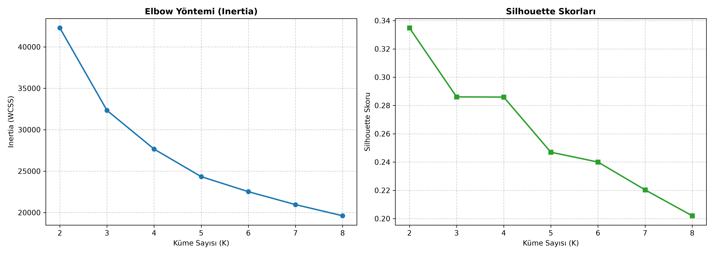
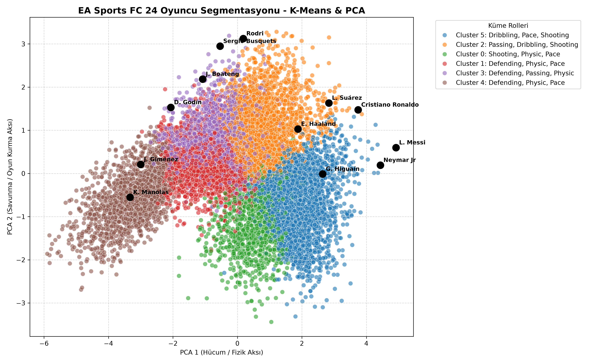

# EA Sports FC 24 Oyuncu Segmentasyonu - K-Means & PCA

Bu projede, geleneksel mevkisel etiketlerin ötesine geçerek EA Sports FC 24 oyuncu veri seti üzerinde **tamamen veri odaklı ve nesnel bir oyuncu segmentasyonu** gerçekleştirdik. Geliştirdiğimiz modüler Python mimarisiyle veriyi istatistiksel olarak kümelere ayırdık ve taktiksel rolleri matematiksel olarak doğruladık.

---

## 🚀 Projenin Amacı ve Kapsamı
Modern futbol kulüplerinin scouting ve kadro planlama süreçlerinde önyargısız, veri temelli ve maliyet etkin kararlar alabilmesi için oyuncuların saf yetenek metriklerini (`pace`, `shooting`, `passing`, `dribbling`, `defending`, `physic`) baz alarak unvan bağımsız bir gruplama yapmak.

---

## 📊 Metodoloji ve İş Adımları
1. **Veri Ön İşleme & Temizlik:** Eksik verilerin temizlenmesi ve analizi bozacak gürültülü alanların arındırılması.
2. **Standardizasyon (`StandardScaler`):** K-Means algoritmasının mesafeye dayalı yapısından ötürü tüm sayısal özniteliklerin ortalamasının 0, varyansının 1 olacak şekilde ölçeklenmesi.
3. **Optimum Küme Sayısı Tespiti ($K=6$):** 
   * **Elbow Yöntemi** ve **Silhouette Skor Analizi** kullanılarak varyansın en ideal temsil edildiği küme sayısı $K=6$ olarak belirlenmiştir.
   * 
4. **Boyut İndirgeme (`PCA`):** Çok boyutlu uzayı 2 boyuta indirgeyerek benzer profilli oyuncuların uzaydaki dağılımının görselleştirilmesi.
   * 

---

## 🏷️ Tespit Edilen Küme Profilleri ($K=6$)

* **Cluster 0 (Target Men / Bitirici Golcüler):** Erling Haaland ve Harry Kane gibi yüksek şut ve fizik gücüne sahip profiller.
* **Cluster 1 (Modern & Mobile CB / Hızlı ve Oyun Kurabilen Stoperler):** Rúben Dias ve Virgil van Dijk gibi geriden oyun kurabilen modern stoperler.
* **Cluster 2 (Creative Playmakers / Klasik Oyun Kurucu):** Kevin De Bruyne ve Martin Ødegaard gibi üst düzey pas, dribbling ve oyun kurma vizyonuna sahip ofansif isimler.
* **Cluster 3 (Box-to-Box / Modern Merkez):** Federico Valverde ve Joshua Kimmich gibi orta sahanın yükünü çeken çift yönlü merkezler.
* **Cluster 4 (Traditional Stoppers / Klasik ve Fiziksel Ağır Stoperler):** Fizik gücü yüksek, hava toplarında etkili klasik kesiciler.
* **Cluster 5 (Explosive Wingers / Patlayıcı Kanat & Forvet):** Kylian Mbappé ve Vinicius Jr. gibi hız ve dribbling yeteneği tavan yapmış patlayıcı isimler.

---

## 📂 Proje Dosya Yapısı

```text
├── outputs/
│   ├── elbow_silhouette.png       # Elbow ve Silhouette grafik çıktıları
│   ├── player_clusters_pca.png    # PCA 2D Küme dağılım görseli
│   ├── cluster_summary.csv        # Küme bazlı istatistiksel ortalama özetleri
│   └── cluster_[0-5]_top100.csv   # Her kümeye ait en iyi 100 oyuncu listeleri
├── data/                          # Ham veri seti
├── notebooks/                     
└── README.md
